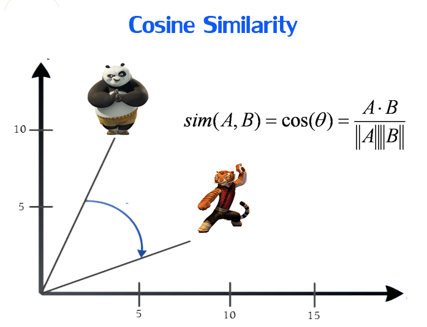

## Movie Recommender

### Data

This project uses data from the ml-100k dataset to generate movie recommendations based on what similar users in the data set enjoyed. It was built using Apache SparkSQL and SparkDatasets.

**mlk-100 dataset** : https://grouplens.org/datasets/movielens/100k/

### Similarity Metric

We used the cosine similarity metric to compute a similarity rating which is how we were able to generate recommendations. We set the threshold to 0.97 to be able to recommend a movie. The metric ranges from 1 (Exactly The Same) to -1 (Polar Opposite).

### Function

The Spark driver script takes in a movieID as input and outputs 10 movie recommendations based on that movie.

You can test this for yourself by looking up your favorite movie from the u.item dataset and passing it as an argument to the Spark Script.
